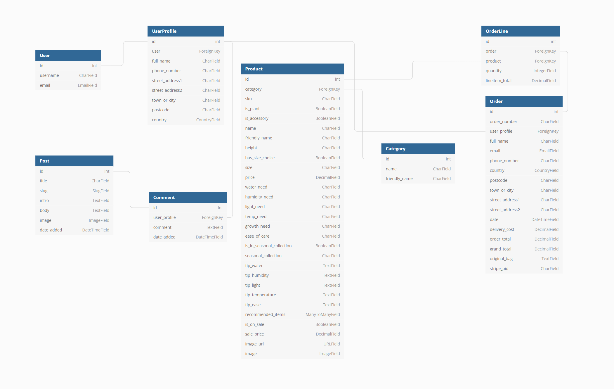

# MS4 - Greensleeves

Welcome to Greensleeves. This full-stack Django e-commerce application provides users a selection of indoor plants and accessories alongside providing members advice on plant care and the opportunity to ask questions in the admin-managed Plant Care Club blog. The site provides plant-lovers the oppurtunity to explore the wide variety of indoor plants ranging in care level and needs, from beginner plant-parents to more experienced greenfingers. 

The website provides the following purpose:

* Sell a variety of products for all experience levels
* Provide information on adequate care for the user's plant of choice
* Allow members to dive deeper into the plant world by providing access to blogs, opinion pieces and leave comments

Anyone can purchase an item from the site without registering for an account, but users will need to create an account to save their information should they wish to purchase again, read blog posts and leave comments. Admin (superuser) can also conduct these activities, as well as adding, editing and deleting items from the store and creating blog posts. This, therefore, creates two types of users: 

* **Guest**: can purchase any item from the store and submit a contact request with no account needed
* **Member**: can save personal details such as shipping address and view past orders, view blog posts and leave comments
* **Admin**: can do all of the above, plus add, edit or remove items from the store, post blog articles and leave comments, and access the admin/management console

This app would be of interest to:

* Beginner plant owners who want to learn how to care for plants
* Experienced plant owners who want to expand their collection

Greensleeves was created for educational purposes as the 4th milestine project for the Code Institute's Full Stack Software Development Diploma. 

[The live site can be found here.](https://ms4-greensleeves.herokuapp.com/)

***(PLEASE NOTE: This is an educational site so do not use real card numbers upon checkout!)***

# Table of contents
* [UX](https://github.com/lmw95/MS4-greensleeves#ux)
* [Features](https://github.com/lmw95/MS4-greensleeves#user-stories)
* [Technologies](https://github.com/lmw95/MS4-greensleeves#technologies)
* [Data structure](https://github.com/lmw95/MS4-greensleeves#data-structure)
* [Testing](https://github.com/lmw95/MS4-greensleeves#testing)
* [Deployment](https://github.com/lmw95/MS4-greensleeves#deployment)
* [Credits](https://github.com/lmw95/MS4-greensleeves#credits)

## **UX**

**Design**

This website was built using Bootstrap 5 and makes use of Bootstrap's built in classes, components (such as navbar, buttons and modals) and grid layout. The design provides a clean and minimal palette with icons and eye-catching images (from FontAwesome, Flaticon, Unplash and Pexels) to guide the user through the site, allowing the majority of the colour of the site to come from the products. The minimal design ensures the pages do not become cluttered, and is easy to navigate and remain as intuitive as possible. To new users, the purpose of the site becomes clear on initial visit, with the slogan 'for the love of things that grow', the hero image and the immediate links to the products acting as reinforcement. The text is simple and clean, using an old-timey serif font to portray a sense of timelessness (like gardening and plantcare) to appeal to all ages, with the logo of the site in cursive to stand out from the rest of the site and provide a fun edge.

The products are displayed as 4 items per x-large, 3 items per large, 2 per medium and 1 per small/x-small screen. Every page is designed to be responsive and will respond depending on the contents of the page (eg. shrinking text, changing margins/padding, flexbox changes, etc). Any data concerning user data, such as order history or order summary, is stored in a table for easy viewing. 

User feedback appears as a toast message in the top-right corner of the screen, the message dependant on the user action. These toasts are colour coded according to the nature of the message, such as red for danger when a user action has failed or green for success when a user action has been successful. All messages are dismissable by the small 'x' in the corner. The same is true for the user's basket, which displays how many items are in their basket, but clicking on the cart icon will display a side offcanvas with a summary of the user's basket contents with a link to visit checkout or keep shopping. 

All deleted actions will have defensive programming in place, to prevent the user from deleting some of their data by accident. This allows the user to click cancel if so. The confirmation to delete, along with all other delete functionality, is marked red to indicate that the user will be deleting data, or be in the process of deleting data, by clicking this link. However, this does not include a user deleting an item from their basket, which will be done as soon as the user clicks the bin icon, as asking the user to confirm deletion on every action could slow down the user journey. 

Forms on the website utilise the django-crispy-forms package for maximum responsiveness. Those that also require card payment use Stripe Elements for authorisation and payment processing.

**User stories**

*Site owner goals*
* To increase customer base to include younger demographics
* To spread awareness of proper plant care amongst new plant owners through simple
* To offer tools to new plant parents with the aim of translating interest into sales 
* To spread the joy of plant ownership

*User goals*
* To access the website across multiple devices
* To discover new plants and tools
* To learn about proper plant care
* To buy plants and accessories from a trusted source

*Site user*
* As a site user, I want to be able to browse the selection of plants and accessories so I can decide whether I want to make a purchase
* As a site user, I want to be able to easily navigate the site so I can get to the specifc section that I need
* As a site user, I want the website to be responsive so that I can access it on a variety of devices
* As a site user, I want to see information about the plants (sucb as ease of care, humidity, watering, light, air purifying, etc.) so that I can assess whether this plant is for me
* As a site user, I want to see suggested accessories on each plant page so that I know which tools I need should I buy this plant
* As a site user, I want to be able to contact the sito buy more than one
* As a shopper, I want to be able to instantly see how many items are in my 'shopping bag' without needing to enter ite owner should I have any questions
* As a site user, I want to be made aware of any deals or shipping discounts available
* As a site user, I want to be able to visit the site's social media so that I can keep up with any deals or lates events
* As a site user, I want to be able to register with an account, so that I can see my past orders

*Shopper*
* As a shopper, I want to see prices of the plants and accessories so I can judge whether I can afford them
* As a shopper, I want to be able to filter search results or all items (for example by price, ease of care, plant type or plant origins etc.) so that I can quickly narrow down my search
* As a shopper, I want to be able to see all items or search for items and have my results displayed to me
* As a shopper, I want to be able to select quantity of items in case I want t
* As a shopper, I want to be able to see my 'shopping bag' so I can see what I'm planning to buy
* As a shopper, I want to be able to see the total of my 'shopping bag' 
* As a shopper, I want to enter payment information in a safe and secure way so that I can checkout quickly with confidence my details will be protected
* As a shopper, I want to receive confirmation of my order so that I can have a proof of purchase
* As a shopper, I want to be able to notify whether my items are a gift and the ability to write a personalised message 

*Account holder*
* As an account holder, I want to be able to log in and out safely
* As an account holder, I want to be able to edit my profile so that I can update my personal information
* As an account holder, I want to delete my account so that my personal information are removed from the website
* As an account holder, I want to be able to favourite items so that I may come back to them at a later date
* As an account holder, I want to be able to view exclusive blog posts and leave comments as feedback

*Administration*
* As site admin, I want to add, edit and delete an item and its contents so that the website stays up to date and accurate
* As site admin, I want to be able to add related products so that I can encourage multiple sales
* As site admin, I want to be able to edit most of the content of the website, so that I can keep my website up to date
* As site admin, I want to manage orders from the console so I can keep up to date with them

**Wireframes**

* [Homepage](https://github.com/lmw95/MS4-greensleeves/blob/main/documentation/wireframes/homepage.png)
* [About](https://github.com/lmw95/MS4-greensleeves/blob/main/documentation/wireframes/about.png)
* [Contact us](https://github.com/lmw95/MS4-greensleeves/blob/main/documentation/wireframes/contact.png)
* [Shop items](https://github.com/lmw95/MS4-greensleeves/blob/main/documentation/wireframes/shop.png)
* [Item page](https://github.com/lmw95/MS4-greensleeves/blob/main/documentation/wireframes/item-page.png)
* [Checkout](https://github.com/lmw95/MS4-greensleeves/blob/main/documentation/wireframes/checkout.png)
* [Sign in / log in](https://github.com/lmw95/MS4-greensleeves/blob/main/documentation/wireframes/signin-login.png)
* [Profile](https://github.com/lmw95/MS4-greensleeves/blob/main/documentation/wireframes/profile.png)
* [Shopping bag modal](https://github.com/lmw95/MS4-greensleeves/blob/main/documentation/wireframes/shopping-bag.png)
* [Order successful](https://github.com/lmw95/MS4-greensleeves/blob/main/documentation/wireframes/order-success.png)
* [FAQs](https://github.com/lmw95/MS4-greensleeves/blob/main/documentation/wireframes/faqs.png)
* [Statements](https://github.com/lmw95/MS4-greensleeves/blob/main/documentation/wireframes/statements.png)
* [Policies](https://github.com/lmw95/MS4-greensleeves/blob/main/documentation/wireframes/policies.png)

[Back to top](https://github.com/lmw95/MS4-greensleeves#ms4---greensleeves)

## **Features**

*Guests*

* A responsive fixed navbar which allows the user to browse the shop by providing links to all places in the site, and the links to both the user profile and shopping cart. The menu is responsive and is accessible by a burger menu on screens smaller than 991px. 
* A search bar where the user can type any search term and be redirected to the search results returned based on that query, with the user's search term reinforced as text at the top of the page. If no products are found, the results page will display the message 'no items found'.
* Two call to action buttons in the center-left of the hero image, which takes the user directly to the shop - from there they can use the shop's filters to their needs.
* A shop page that displays all products. These can either be rendered from a query search or by using the shop filters at the top of the page. This will also display the filter, query and the number of results found. After filtering the user can then further sort the results by A-Z or price. Each item will display the item image, name, collection (if any), price and a link to view the item.
* An item page for every item providing information on the item, such as plant care needs and recommended items. The user can add the item to their cart from this page, thereby giving the user a chance to gain information on the product before purchasing and if it will be right for them (this shop has a strict policy about plant waste and tries to discourage impulse buying)
* A button to take the user to the top of the page.
* A real-time cart item total that can be clicked on to open the shopping bag offcanvas to display the users items.
* A shopping bag offcanvas and a 'bag' page that lists all the items in the user's cart and keeps a running subtotal, and calculates the total, delivery, grand total, and how much more the user can spend to get free delivery. The user can also update the quantity of an item in their cart on the bag page, or remove it from their cart entirely.
* A checkout page where the user enter their billing and shipping information, and check out securely using Stripe
* A footer that displays social media icons, copyright info and 'Contact Us' text, that takes the user back to the contact page
* A blog page which displays the blogs and articles provided by the Greensleeves staff, which is exlusive to logged-in members only. On these pages, the user can also leave comments. If the user is not logged-in/authenticated, they will be redirected to the log-in page if they follow the link on the blog preview.
* Pop-up toasts providing user feedback depending on the action taken, such as adding items to their cart or successfully checking out
* An automatic redirect to the login page using the @login_required decorator if the user attempts to access a URL that only logged in users can see
* An automatic redirect to the home page if the user attempts to access a URL that they are not authorised to view
* Validation errors that appear in red if a field in a form is not filled out correctly
* A 404 page that is rendered if the user enters an invalid URL

*Members*
* A profile page where the user can view and update their account details and their order history, and delete their account
* A form & modal for updating the user's account details
* Full access to blog posts and the ability to leave comments on the blogs

*Admin*
* Ability to add blog posts through admin/superuser console
* An admin panel page where the administrator can manage the site
* The ability to add, edit or delete items from the shop

*Features left to implement*
* The ability for logged-in users to leave reviews
* Functionality that filters out swearing/slurs/offensive language in user comments, potentially utlising [profanity-filter](https://pypi.org/project/profanity-filter/) and give admin the ability to delete user comments due to inappropriate language
* A newsletter functionality (subscribe)
* Admin can manage stock levels
* Pagination for shop items results
* Users can add items to a wishlist
* Privacy/return policies which were left out due to time contraints

[Back to top](https://github.com/lmw95/MS4-greensleeves#ms4---greensleeves)

## **Technologies**
**Languages**
* [HTML](https://en.wikipedia.org/wiki/HTML)
* [CSS](https://en.wikipedia.org/wiki/CSS)
* [JavaScript](https://en.wikipedia.org/wiki/JavaScript)
* [Python](https://en.wikipedia.org/wiki/Python_(programming_language))

**Libraries, frameworks, packages & extensions**
* [jQuery](https://jquery.com/)
* [Django](https://www.djangoproject.com/)
    * django-allauth
    * crispy-forms
    * django-countries
    * django-storages
    * dj-stripe
    * django-mathfilters
* [Jinja](https://jinja.palletsprojects.com/en/3.0.x/)
* [Bootstrap5](https://getbootstrap.com/)
* [FontAwesome](https://fontawesome.com/)
* [AnimateCSS](https://animate.style/)
* [Google Fonts](https://fonts.google.com/)
* [Stripe](https://stripe.com/gb)
* [JSON](https://www.json.org/json-en.html)
* [Pillow](https://pillow.readthedocs.io/en/stable/)

**Database, platforms & cloud storage**
* [Postgres](https://www.postgresql.org/)
    * dj-database-url
    * psycopg2-binary
* [AWS (Amazon Web Services)](https://aws.amazon.com/)
    * Boto3
* [Heroku](https://www.heroku.com/)
    * Gunicorn
    * Heroku Postgres

**Validation**
* [W3C Markup Validation Service](https://validator.w3.org/)
* [W3C CSS Validator](https://jigsaw.w3.org/css-validator/)
* [WAVE Web Accessibility Evaluation Tool](https://wave.webaim.org/)
* [PEP8 online](http://pep8online.com/)
* [JSHint](https://jshint.com/)
* Chrome DevTools
* Google lighthouse

**Other tools**
* [Flaticon](https://www.flaticon.com/)
* [Balsamiq](https://balsamiq.com/)
* [Gitpod](https://www.gitpod.io/)
* [Github](https://github.com/)
* [Django Secret Key Generator](https://miniwebtool.com/django-secret-key-generator/)
* [Temp Mail](https://temp-mail.org/)
* [Gmail](https://mail.google.com/)

[Back to top](https://github.com/lmw95/MS4-greensleeves#ms4---greensleeves)

## **Testing**

To see testing, please see [TESTING.md](https://github.com/lmw95/MS4-greensleeves/blob/main/TESTING.md)

[Back to top](https://github.com/lmw95/MS4-greensleeves#ms4---greensleeves)

## **Data structure**

***Data models***

The project uses Postgres as a relational database to store data in SQL format for the live site, which is visible in the Django admin panel. Model classes allow for interaction with the database. An example of relational data at play is as follows:
* A registered user's user ID is used in the user field of the store user model when they register.
* When the user places an order, the shop order model takes the user's data to populate its store user field with the user's username and attach the order to the user's profile. The order exists in the database as having been placed by this user. If the user deletes their profile, this field is set to null as the order should always exist in the database.
* The order line item model interacts with the shop order model using its shop_order field to create an instance of each item in the user's cart and calculate the total cost.
* If the user checks the 'save user info' box upon checkout, the store user model will get the information from the shop order model and store each entry as the value of its relevant field, namely default_email_address, default_phone_number, default_address_line1 etc.
* When the user next places an order, the shop order model grabs the user's data from the store user model to pre-populate the checkout form with the stored information.
* The post model is created in the admin console, where the superuser populates the fields of post, slug, title, body and date_added (which is grabbed upon creation)
* If a user leaves a comment on a blog, the comment model is populated with the fields post & user_profile (which are grabbed by a foregin key linking the user's comment to the post and the user's username to the comment), comment and date_added (again calculated upon creation). If a post is deleted, the comments are deleted too. 

***Database schema***

***CRUD / defensive design***

**Action** | **Guests** | **Authenticated user** | **Superuser / Admin**
-- | -- | -- | --
View homepage | Yes | Yes | Yes
View about page | Yes | Yes | Yes
View FAQs | Yes | Yes | Yes
View contact page | Yes | Yes | Yes
Submit contact query | Yes | Yes | Yes
View shop | Yes | Yes | Yes
Submit search query | Yes | Yes | Yes
View shop item | Yes | Yes | Yes
Add/edit/delete shop item | No | No | Yes
Add/edit/delete shop category | No | No | Yes
View shopping bag | Yes | Yes | Yes
Add/update/delete item from bag | Yes | Yes | Yes
Checkout | Yes | Yes | Yes
Login | Yes | Yes | Yes
Register | Yes | Yes | No
View profile | Yes | Yes | Yes
Edit profile | Yes | Yes | Yes
Delete account | Yes | Yes | Yes
View order history | Yes | Yes | Yes
View blog list | Yes | Yes | Yes
View blog page | No | Yes | Yes
Add blog post | No | No | Yes
Add comment to blog | No | Yes | Yes

***Defensive design***
* All delete functions apart from deleting items from the users bag are done using defensive programming - a modal will pop up asking the user to confirm their decision before deletion (the only function that exists like this is the deletion of the user's account)

## **Deployment**

To see deployment, please see [DEPLOYMENT.md](https://github.com/lmw95/MS4-greensleeves/blob/main/DEPLOYMENT.md)

[Back to top](https://github.com/lmw95/MS4-greensleeves#ms4---greensleeves)

## **Credits**

***Code, media and content***

To see credits, please see [CREDITS.md](https://github.com/lmw95/MS4-greensleeves/blob/main/CREDITS.md)

***Acknowledgements***
* Inspiration for this site comes from other plant sites such as [Beards & Daisies](https://www.beardsanddaisies.co.uk/cart)
* Thank you to everyone who has supported me throughout this diploma, including my mentor, fellow students and as always, StackOverflow
* Shout out to my parents who have been great springboards for ideas and inspiration
* Special thanks to my boyfriend Connor, who has been a strong shoulder of support throughout this life-changing period, and has been there through my grumbles, stresses and celebrations!

[Back to top](https://github.com/lmw95/MS4-greensleeves#ms4---greensleeves)
