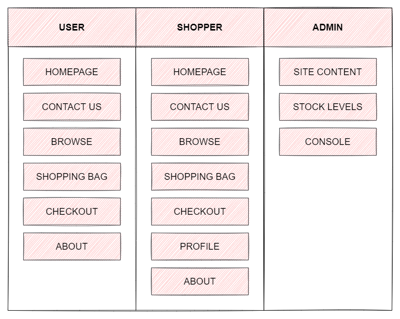
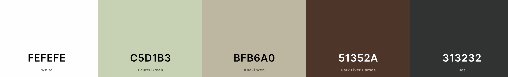

# MS4 - Greensleeves

Welcome to Greensleeves. This full-stack Django e-commerce application provides users a selection of indoor plants and accessories alongside providing members advice on plant care and the opportunity to ask questions in the admin-managed Plant Care Club blog. The site provides plant-lovers the oppurtunity to explore the wide variety of indoor plants ranging in care level and needs, from beginner plant-parents to more experienced greenfingers. 

The website provides the following purpose:

* Sell a variety of products for all experience levels
* Provide information on adequate care for the user's plant of choice
* Allow members to dive deeper into the plant world by providing access to blogs, opinion pieces and leave comments

Anyone can purchase an item from the site without registering for an account, but users will need to create an account to save their information should they wish to purchase again, read blog posts and leave comments. Admin (superuser) can also conduct these activities, as well as adding, editing and deleting items from the store and creating blog posts. This, therefore, creates two types of users: 

* **Guest**: can purchase any item from the store and submit a contact request with no account needed
* **Member**: can save personal details such as shipping address and view past orders, view blog posts and leave comments
* **Admin**: can do all of the above, plus add, edit or remove items from the store, post blog articles and leave comments, and access the admin/management console

This app would be of interest to:

* Beginner plant owners who want to learn how to care for plants
* Experienced plant owners who want to expand their collection

Greensleeves was created for educational purposes as the 4th milestine project for the Code Institute's Full Stack Software Development Diploma. 

[The live site can be found here.](https://ms4-greensleeves.herokuapp.com/)

# Table of contents
* UX
* Features
* Technologies
* Testing
* Deployment
* Credits

## **UX**

**Design**

This website was built on Bootstrap 5 and makes use of Bootstrap's built in classes, components (such as navbar, buttons and modals) and grid layout. The design provides a clean and minimal palette with icons and eye-catching images to guide the user through the site, allowing the majority of the colour of the site to come from the products. The minimal design ensures the pages do not become cluttered, and is easy to navigate and remain as intuitive as possible. To new users, the purpose of the site becomes clear on initial visit, with the slogan 'for the love of things that grow', the hero image and the immediate links to the products acting as reinforcement. The text is simple and clean, using an old-timey serif font to portray a sense of timelessness (like gardening and plantcare) to appeal to all ages, with the logo of the site in cursive to stand out from the rest of the site and provide a fun edge.

The products are displayed as 4 items per x-large, 3 items per large, 2 per medium and 1 per small/x-small screen. Every page is designed to be responsive and will respond depending on the contents of the page (eg. shrinking text, changing margins/padding, flexbox changes, etc). Any data concerning user data, such as order history or order summary, is stored in a table for easy viewing. 

User feedback appears as a toast message in the top-right corner of the screen, the message dependant on the user action. These toasts are colour coded according to the nature of the message, such as red for danger when a user action has failed or green for success when a user action has been successful. All messages are dismissable by the small 'x' in the corner. The same is true for the user's basket, which displays how many items are in their basket, but clicking on the cart icon will display a side offcanvas with a summary of the user's basket contents with a link to visit checkout or keep shopping. 

All deleted actions will have defensive programming in place, to prevent the user from deleting some of their data by accident. This allows the user to click cancel if so. The confirmation to delete, along with all other delete functionality, is marked red to indicate that the user will be deleting data, or be in the process of deleting data, by clicking this link. However, this does not include a user deleting an item from their basket, which will be done as soon as the user clicks the bin icon, as asking the user to confirm deletion on every action could slow down the user journey. 

Forms on the website utilise the django-crispy-forms package for maximum responsiveness. Those that also require card payment use Stripe Elements for authorisation and payment processing.

**User stories**

## **Strategy**

***Site owner goals***
* To increase customer base to include younger demographics
* To spread awareness of proper plant care amongst new plant owners through simple
* To offer tools to new plant parents with the aim of translating interest into sales 
* To spread the joy of plant ownership

***User goals***
* To access the website across multiple devices
* To discover new plants and tools
* To learn about proper plant care
* To buy plants and accessories from a trusted source

---

## **User stories**

***Site user***
* As a site user, I want to be able to browse the selection of plants and accessories so I can decide whether I want to make a purchase
* As a site user, I want to be able to easily navigate the site so I can get to the specifc section that I need
* As a site user, I want the website to be responsive so that I can access it on a variety of devices
* As a site user, I want to see information about the plants (sucb as ease of care, humidity, watering, light, air purifying, etc.) so that I can assess whether this plant is for me
* As a site user, I want to see suggested accessories on each plant page so that I know which tools I need should I buy this plant
* As a site user, I want to be able to contact the site owner should I have any questions
* As a site user, I want to be made aware of any deals or shipping discounts available
* As a site user, I want to be able to see the most popular plants on the site
* As a site user, I want to be able to read reviews of others that have used the site
* As a site user, I want to be able to visit the site's social media so that I can keep up with any deals or lates events
* As a site user, I want to be able to register with an account, so that I can see my past orders

***Shopper***
* As a shopper, I want to see prices of the plants and accessories so I can judge whether I can afford them
* As a shopper, I want to be able to filter search results or all items (for example by price, ease of care, plant type or plant origins etc.) so that I can quickly narrow down my search
* As a shopper, I want to be able to see all items or search for items and have my results displayed to me
* As a shopper, I want to be able to select quantity of items in case I want to buy more than one
* As a shopper, I want to be able to instantly see how many items are in my 'shopping bag' without needing to enter it
* As a shopper, I want to be able to see my 'shopping bag' so I can see what I'm planning to buy
* As a shopper, I want to be able to see the total of my 'shopping bag' 
* As a shopper, I want to enter payment information in a safe and secure way so that I can checkout quickly with confidence my details will be protected
* As a shopper, I want to receive confirmation of my order so that I can have a proof of purchase
* As a shopper, I want to be able to notify whether my items are a gift and the ability to write a personalised message 

***Account holder***
* As an account holder, I want to be able to log in and out safely
* As an account holder, I want to be able to edit my profile so that I can update my personal information
* As an account holder, I want to be able to reset my password if I forget it
* As an account holder, I want to delete my account so that my personal information are removed from the website
* As an account holder, I want to be able to favourite items so that I may come back to them at a later date
* As an account holder, I want to be able to leave a review of the website so that I can notify other users of my experience

***Administration***
* As site admin, I want to add, edit and delete an item and its contents so that the website stays up to date and accurate
* As site admin, I want to be able to add related products so that I can encourage multiple sales
* As site admin, I want to be able to edit most of the content of the website, so that I can keep my website up to date
* As site admin, I want to manage orders from the console so I can know I have dispatched orders

---

## **Scope**
***Functional requirements***
* Content
    * Responsive design 
    * Collapsable menu
* User authentication
    * User can register securely
    * User can log in / log out
    * User can edit profile information
    * User can view profile
    * User can delete profile
* Search & shop
    * See all items
    * Sort items by various filters 
    * Search website with search bar
    * Display search details
    * Paginate site items
* Shopping bag & checkout
    * Display shopping bag notification
    * Add / delete item
    * View shopping bag
    * Update quantities
    * Add / edit delivery information
    * Add gift option
    * Add gift option message
    * Enter payment details
    * Process & complete payment
    * Show order in user's account
* Feeback
    * Feedback on user authentication
    * Email to verify user email
    * Email for order confirmation
    * Email for order dispatch
    * Feedback for deleted user
* Contact & interaction
    * User can leave reviews
    * Display testimonials
    * Contact site owner
    * Links to social media
* Site administration
    * Add / edit / delete items
    * Add / edit / delete filters
    * Link items to filter categories
    * Display items 
    * Update all site content
* Inventory
    * Add stock quantities
    * Adjust stock quantities after orders
* Error handling
    * Handle errors 403, 404, 500

***Non-functional requirements***  
* Interactive components
* Navigatable and minimal design
* Aesthetically pleasing display of items and content

***Content rquirements***
* Details about company
* Information regarding plant care
* Information regarding accessories
* Images of plants and accessories
* Forms where user input is needed
* Attractive layout to guide users through site
* Icons for interactive elements and sub-sections

***Limitations***
* The site owner is in the process of learning Python and Django which may limit the features available on the website
* There is a time limit which may place constraints on certain elements which will need to be planned carefully

---

## **Structure**
***Architecture***

***Organisation***
* Header: Collapsable navbar with brand logo and navigation links
* Homepage: Hero image, information about the company, suggested plants, company reviews and offers on delivery etc.
* Profile: Registered users can see delivery info, preferred payment info, favourited items "for later"
* About: Company info, statements and history
* Plants: All the available plants to buy
* Accessories: All the available accessories to buy
* Product page: Information about the selected product
* Shopping bag: User's items to buy
* Contact us: Get in touch with company
* Footer: Social media links and statements

***Database structure***

[to be added]

--- 

## **Skeleton**

* [Homepage](https://github.com/lmw95/MS4-greensleeves/blob/main/documentation/wireframes/homepage.png)
* [About](https://github.com/lmw95/MS4-greensleeves/blob/main/documentation/wireframes/about.png)
* [Contact us](https://github.com/lmw95/MS4-greensleeves/blob/main/documentation/wireframes/contact.png)
* [Shop items](https://github.com/lmw95/MS4-greensleeves/blob/main/documentation/wireframes/shop.png)
* [Item page](https://github.com/lmw95/MS4-greensleeves/blob/main/documentation/wireframes/item-page.png)
* [Checkout](https://github.com/lmw95/MS4-greensleeves/blob/main/documentation/wireframes/checkout.png)
* [Sign in / log in](https://github.com/lmw95/MS4-greensleeves/blob/main/documentation/wireframes/signin-login.png)
* [Profile](https://github.com/lmw95/MS4-greensleeves/blob/main/documentation/wireframes/profile.png)
* [Shopping bag modal](https://github.com/lmw95/MS4-greensleeves/blob/main/documentation/wireframes/shopping-bag.png)
* [Order successful](https://github.com/lmw95/MS4-greensleeves/blob/main/documentation/wireframes/order-success.png)
* [FAQs](https://github.com/lmw95/MS4-greensleeves/blob/main/documentation/wireframes/faqs.png)
* [Statements](https://github.com/lmw95/MS4-greensleeves/blob/main/documentation/wireframes/statements.png)
* [Policies](https://github.com/lmw95/MS4-greensleeves/blob/main/documentation/wireframes/policies.png)

---

## **Surface**
The overall design of the website will be minimal with splashes of colour coming from the icons and certain sections of each page.

***Colour*** 

The colour palette will feature mostly 'Earthy' and muted colours, keeping in tone with the website's products. I chose the colours below using [Coolors]().

***Imagery***

The images used in the website will come from [Flaticon]() and are linked in the Credits section. All images will be relevant to the content they are used in conjunction with, and will be used sparingly throughout the site. 

***Typography***
* [Pacifico](https://fonts.google.com/specimen/Pacifico?category=Handwriting#standard-styles) will be used for the brand logo only
* [Prata](https://fonts.google.com/specimen/Prata?category=Serif) will be used for headers
* [Be Vietnam Pro](https://fonts.google.com/specimen/Be+Vietnam+Pro?category=Sans+Serif&preview.text=%C2%A315.00&preview.text_type=custom) will be used as the body text

***Iconography***

Icons will be from [FontAwesome](https://fontawesome.com/) and [Flaticon](https://www.flaticon.com/) and will be used to highlight certain bits of information or interactive elements like buttons

# Technologies
### **Languages**
* HTML
* CSS
* JavaScript
* Python

### **Libraries & frameworks**
* jQuery
* Django
* Gunicorn
* Jinja
* Bootstrap5
* FontAwesome
* AnimateCSS
* crispy-forms
* Google Fonts

### **Database, platforms & cloud storage**
* SQLite
* Heroku Postgres
* Amazon AWS S3
* Heroku

### **Validation**
* W3C Markup Validation Service
* W3C CSS Validator
* WAVE Web Accessibility Evaluation Tool
* PEP8 online
* JSHint
* Chrome DevTools
* Google lighthouse

### **Other tools**
* Flaticon
* Stripe
* Balsamiq
* Dbdiagram.io

# Credits

***Code, media and content***

[See all credits here]()

***Acknowledgements***
* Inspiration for this site comes from other plant sites such as [Beards & Daisies](https://www.beardsanddaisies.co.uk/cart)

